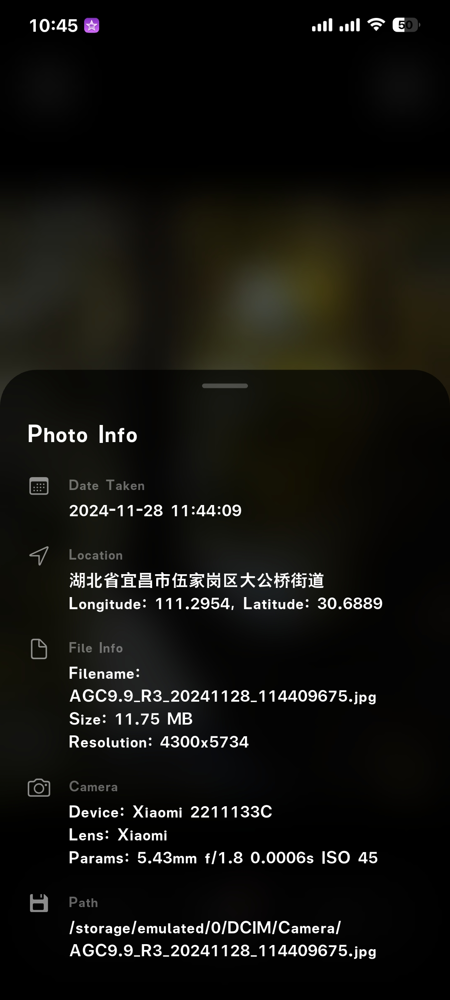
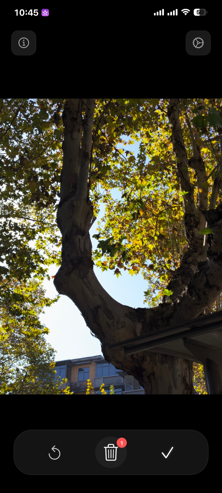
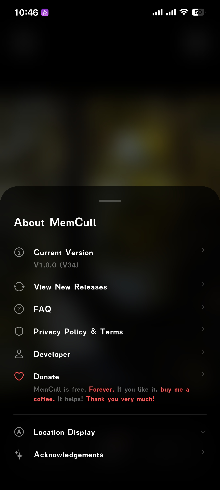
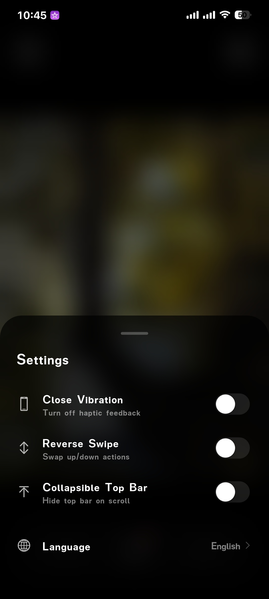
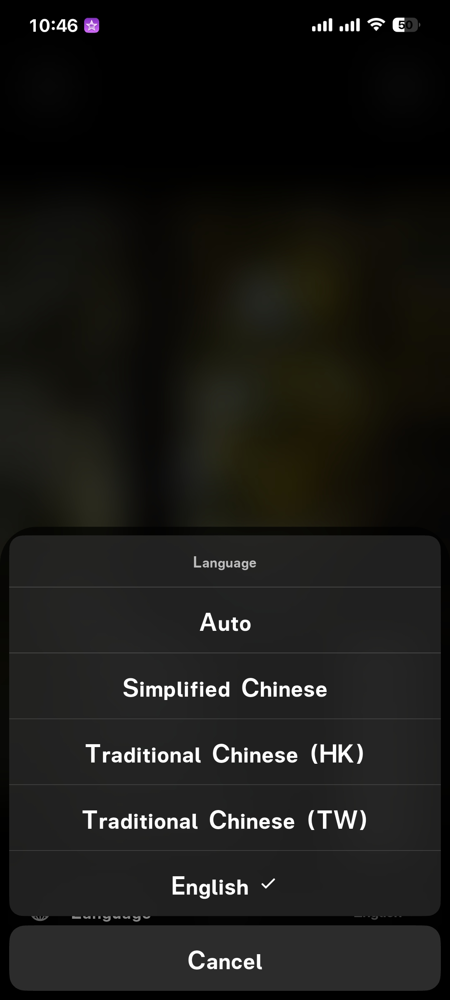
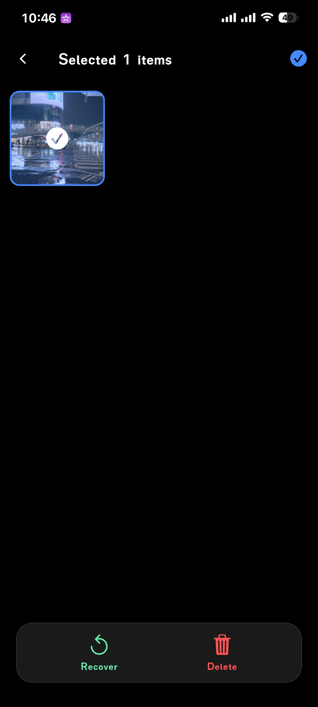

# MemCull

[](https://flutter.dev/)
[](LICENSE)
[](https://memcull.seegood.top)

[English Version](./README.md) | [官方网站](https://memcull.seegood.top)

MemCull 是一款简洁优雅的照片整理应用，旨在帮助您快速清理手机相册。它采用类似 Tinder 的滑动界面，让筛选成百上千张照片变得轻而易举。
有朋友资助我25美金注册Google 开发者账户，将此应用上传到谷歌商店吗？十分感谢！无论如何这个软件都是免费且常规使用页面无广告的。

## ✨ 功能特性

- **直观滑动**：上滑删除，下滑保留。
- **毛玻璃 UI**：现代、简洁的设计，带有模糊效果和流畅动画。
- **逆地理编码**：利用 EXIF 元数据查看照片拍摄地点（由高德提供支持，目前支持中国大陆）。
- **回收站**：在永久从设备删除照片之前，可以在回收站中进行预览和恢复。
- **批量处理**：使用 sqflite 数据库实现高性能的照片加载和处理。
- **多语言支持**：支持英文、简体中文和繁体中文（香港/台湾）。
- **性能优化**：并发资源加载和高级图片预加载机制，确保无卡顿体验。

## 🚀 技术栈

- **框架**：[Flutter](https://flutter.dev/)
- **状态管理**：[Provider](https://pub.dev/packages/provider)
- **本地数据库**：[sqflite](https://pub.dev/packages/sqflite)
- **资源管理**：[photo_manager](https://pub.dev/packages/photo_manager)
- **国际化**：Flutter Localizations (i18n)

## 🛠️ 快速上手

### 环境准备

- Flutter SDK (v3.10.7 或更高版本)
- Android Studio / VS Code (安装有 Flutter 插件)
- 一台 Android 设备或模拟器

### 安装步骤

1. 克隆仓库：
   ```bash
   git clone https://github.com/your-username/MemCull.git
   cd MemCull
   ```

2. 安装依赖：
   ```bash
   flutter pub get
   ```

3. 配置高德 Key（可选，用于显示拍摄地点）：
   - 在 [高德开放平台](https://lbs.amap.com/) 注册。
   - 创建一个“Web 服务”类型的 Key。
   - 在应用的位置配置页面输入该 Key。

4. 运行应用：
   ```bash
   flutter run
   ```

## 📸 界面预览

| 图片信息 | 主页 | 关于 |
| :---: | :---: | :---: |
|  |  |  |

| 设置 | 多语言 | 回收站 |
| :---: | :---: | :---: |
|  |  |  |

## 📄 开源协议

本项目基于 MIT 协议开源 - 详情请参阅 [LICENSE](LICENSE) 文件。

## 🙏 特别鸣谢

- [photo_manager](https://pub.dev/packages/photo_manager) 提供了出色的媒体库访问支持。
- [高德地图](https://lbs.amap.com/) 提供了逆地理编码服务。
